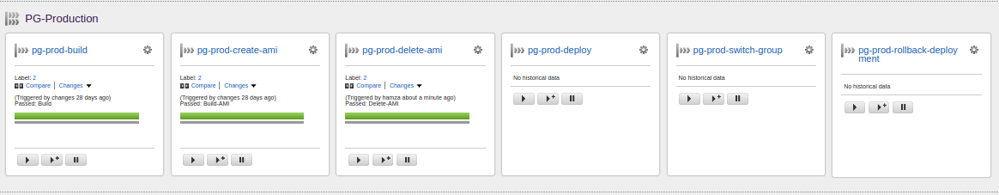
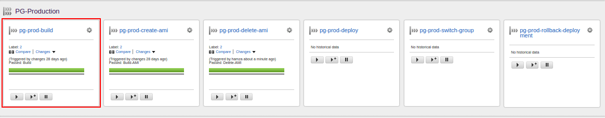
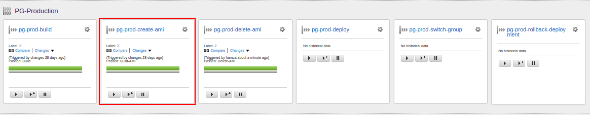
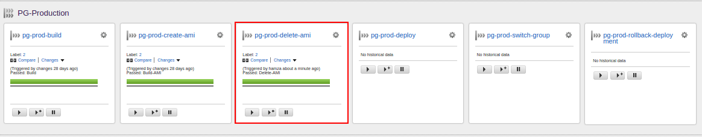
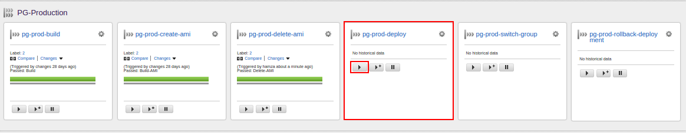
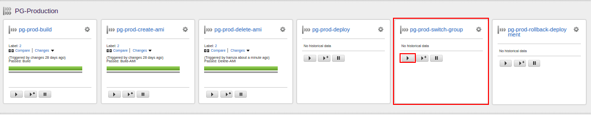
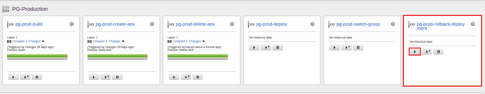
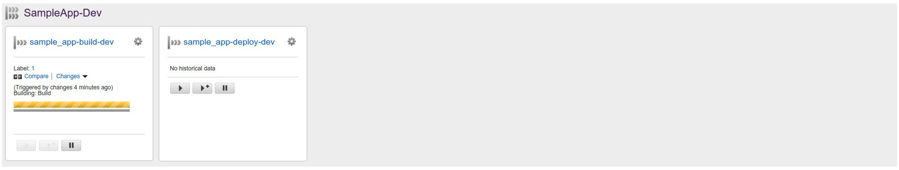
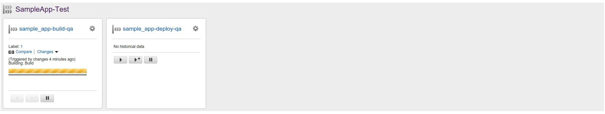

# How to configure GoCD config for Blue Green Deployment

## What is cruise-config.xml?
It is the config file used by GoCD to configure its pipelines.

More: https://docs.go.cd/16.5.0/configuration/configuration_reference.html


## Where is cruise-config.xml?

###Before Creating your Infrastructure:
1. Navigate to `infrastructure-modules/global-admiral/data/gocd/conf`
2. Open `cruise-config.xml`

###After your GoCD is up and running:
1. Open the GoCD pipelines view
2. Click on `Admin` from the top menu
3. Select `Config XML` to open the `cruise-config.xml`

## Setting up Production Pipelines (BG-Deployment)

The production pipeline group consists of five pipelines, each representing a stage in the production process. Following is a list of the pipelines in the production pipeline group.

1. **Build Application:** Compile, execute application tests and build application.

2. **Create Amazon Machine Images (AMI):** Create AMI for deploying.

3. **Deploy to Production (Blue Green Deployment Related):** Launch AMI created in the previous step.

4. **Switch Group (Blue Green Deployment Related):** Switch to the new tested deployment group.

5. **Rollback Deployment (Blue Green Deployment Related):** Rollback deployment to the previous state.


****


### Build Application Pipeline:

First in the production pipeline group, this pipeline is responsible for compiling code, executing application tests and building application. The pipeline is triggered automatically when changes are made in the code base and fails if any of the three stages fail.
```
        <pipeline name="app-build-prod" template="stakater_build">
          <params>
            <param name="SOURCE_DIR" />
            <param name="APP_NAME"></param>
            <param name="ENVIRONMENT"></param>
            <param name="APP_DOCKER_IMAGE"></param>
          </params>
          <materials>
      	    <git url="" branch="master" />
          </materials>
        </pipeline>
```
*Excerpt # 1: XML for build application pipeline*

****

<table>
  <tr>
    <td>Parameter Name</td>
    <td>Description</td>
  </tr>
  <tr>
    <td>APP_NAME</td>
    <td>Name of the application to be deployed.

        NOTE: The name for one application should be the same in all the pipelines and should only contain alphabets, numbers and special characters "-" “_” .
        <br/><br/>Example:
        &lt;param name="APP_NAME"&gt;test_app&lt;/param&gt;</td>
  </tr>
  <tr>
    <td>ENVIRONMENT</td>
    <td>The environment application should run in. Set the value to ‘prod’ for the production environment.

<br/><br/>Example:
&lt;param name="ENVIRONMENT"&gt;prod&lt;/param&gt;</td>
  </tr>
  <tr>
    <td>APP_DOCKER_IMAGE</td>
    <td>Name of your application’s docker image that is being created, and will be used in instances fired up from the created machine image.

<br/><br/>Example:
&lt;param name="APP_DOCKER_IMAGE"&gt;registry.stakater-reference.local:80/app_prod&lt;/param&gt;</td>
  </tr>
</table>


*Table 1: Description of build application pipeline parameters*

To setup the pipeline, fill in the values for `APP_NAME`, `ENVIRONMENT` and `APP_DOCKER_IMAGE` parameters. Once that is done, setup the material (source of changes) for the pipeline. Provide the url and branch of the Git repository from where to pull the code to be deployed.

Example:
```
      <git url="<BitBucket URL HERE>" branch="master" />
```

*NOTE: Use `stakater_build` template in build application pipeline.*

###Create AMI Pipeline:
This pipeline creates the `Amazon Machine Image(AMI)` that is used in deployment. The pipeline is triggered automatically as well when the build pipeline completes successfully  and fails if there is an error in AMI creation.
```
      <pipeline name="app-create-ami-prod" template="stakater_build_ami">
        <params>
          <param name="SOURCE_DIR" />
          <param name="APP_NAME"></param>
          <param name="ENVIRONMENT">live</param>
          <param name="APP_DOCKER_IMAGE"></param>
          <param name="APP_DOCKER_OPTS"></param>
          <param name="CLOUDINIT_S3_FULL_PATH" />
          <param name="DATA_EBS_DEVICE_NAME">/dev/sdf</param>
          <param name="DATA_EBS_VOL_SIZE">50</param>
          <param name="LOGS_EBS_DEVICE_NAME">/dev/sdg</param>
          <param name="LOGS_EBS_VOL_SIZE">20</param>
        </params>
        <materials>
          <pipeline pipelineName="app-build-prod" stageName="Build" />
        </materials>
      </pipeline>
```
*Excerpt 2: XML for create AMI  pipeline*

****

<table>
  <tr>
    <td>Parameter Name</td>
    <td>Description</td>
  </tr>
  <tr>
    <td>APP_NAME</td>
    <td>Name of the application to be deployed.

NOTE: The name for one application should be the same in all the pipelines and should only contain alphabets, numbers and special characters "-" “_” .

<br/><br/>Example:
&lt;param name="APP_NAME"&gt;test_app&lt;/param&gt;</td>
  </tr>
  <tr>
    <td>ENVIRONMENT</td>
    <td>Name of the environment for which the blue-green deployment infrastructure will be created.

<br/><br/>Example:
&lt;param name="ENVIRONMENT"&gt;prod&lt;/param&gt;
OR
&lt;param name="ENVIRONMENT"&gt;stage&lt;/param&gt;</td>
  </tr>
  <tr>
    <td>APP_DOCKER_IAMGE</td>
    <td>Name of your application’s docker image that is being created, and will be used in instances fired up from the created machine image.

<br/><br/>Example:
&lt;param name="APP_DOCKER_IMAGE"&gt;registry.stakater-reference.local:80/app_prod&lt;/param&gt;</td>
  </tr>
  <tr>
    <td>APP_DOCKER_OPTS</td>
    <td>Docker Options required to run the container for your application’s docker image.

<br/><br/>Example:
&lt;param name="APP_DOCKER_OPTS"&gt;-p 8080:8080 -v /data/:/data/ &lt;/param&gt;</td>
  </tr>
  <tr>
    <td>CLOUDINIT_S3_FULL_PATH</td>
    <td>Full path of cloudinit file template* in an S3 bucket.
Path should be like <bucket_name>/path/to/file

Note:
* For template details please look at sample cloudinit file for prod in infrastructure-reference

<br/><br/>Example:
&lt;param name="CLOUDINIT_S3_FULL_PATH">stakater-reference-prod-cloudinit/prod/cloud-config.tmpl.yaml&lt;/param&gt;
</td>
  </tr>
  <tr>
    <td>DATA_EBS_DEVICE_NAME</td>
    <td>Device Name for EBS Volume used for data

<br/><br/>Example:
&lt;param name="DATA_EBS_DEVICE_NAME"&gt;/dev/sdf&lt;/param&gt;</td>
  </tr>
  <tr>
    <td>DATA_EBS_VOL_SIZE</td>
    <td>Size of EBS Volume used for data (in GB)

<br/><br/>Example:
&lt;param name="DATA_EBS_VOL_SIZE">50&lt;/param&gt;</td>
  </tr>
  <tr>
    <td>LOGS_EBS_DEVICE_NAME</td>
    <td>Device Name for EBS Volume used for logs

<br/><br/>Example:
&lt;param name="LOGS_EBS_DEVICE_NAME"&gt;/dev/sdf&lt;/param&gt;</td>
  </tr>
  <tr>
    <td>LOGS_EBS_VOL_SIZE</td>
    <td>Size of EBS Volume used for logs

(in GB)

<br/><br/>Example:
&lt;param name="LOGS_EBS_VOL_SIZE"&gt;20&lt;/param&gt;</td>
  </tr>
</table>


*Table 2: Description of create AMI pipeline parameters*

To setup the pipeline, fill in the values for the required parameters and setup the material (source of pipeline changes). This pipeline expects the build image pipeline as its source.

Example:
```
<materials>
        <pipeline pipelineName="app-build-prod" stageName="Build" />
</materials>
```
Change the pipeline name to your build application pipeline name. StageName would remain the same.

*NOTE: Use "stakater_build_ami" template in create AMI pipeline.*

###Delete AMI Pipeline:
This pipeline deletes all `Amazon Machine Image(AMI)` except three.
<ul>
        <li> The most recently created AMI. </li>
        <li> The AMI deployed on Blue group instance. </li>
        <li> The AMI deployed on Green group instance.</li>
</ul>

The pipeline is triggered automatically as well when the create pipeline completes successfully  and fails if there is an error in AMI deletion.
```
      <pipeline name="app-delete-ami-prod" template="stakater_delete_ami">
        <params>
          <param name="SOURCE_DIR" />
          <param name="APP_NAME"></param>
          <param name="ENVIRONMENT">live</param>
        </params>
        <materials>
          <pipeline pipelineName="app-create-ami-prod" stageName="Build-AMI" />
        </materials>
      </pipeline>
```
*Excerpt 3: XML for delete AMI  pipeline*

****

<table>
  <tr>
    <td>Parameter Name</td>
    <td>Description</td>
  </tr>
  <tr>
    <td>APP_NAME</td>
    <td>Name of the application to be deployed.

NOTE: The name for one application should be the same in all the pipelines and should only contain alphabets, numbers and special characters "-" “_” .

<br/><br/>Example:
&lt;param name="APP_NAME"&gt;test_app&lt;/param&gt;</td>
  </tr>
  <tr>
    <td>ENVIRONMENT</td>
    <td>Name of the environment for which the blue-green deployment infrastructure will be created.

<br/><br/>Example:
&lt;param name="ENVIRONMENT"&gt;prod&lt;/param&gt;
OR
&lt;param name="ENVIRONMENT"&gt;stage&lt;/param&gt;</td>
  </tr>
</table>


*Table 2: Description of delete AMI pipeline parameters*

To setup the pipeline, fill in the values for the required parameters and setup the material (source of pipeline changes). This pipeline expects the create image pipeline as its source.

Example:
```
<materials>
        <pipeline pipelineName="app-create-ami-prod" stageName="Build-AMI" />
</materials>
```
Change the pipeline name to your build application pipeline name. StageName would remain the same.

*NOTE: Use "stakater_delete_ami" template in delete AMI pipeline.*

### Deploy to Production Pipeline:

Using the AMI created  in the second stage, this pipelines deploys the application. It need to be triggered manually and  deploys application using the technique of blue green deployment.
```
      <pipeline name="app-deploy-prod" template="stakater_launch_ami">
        <params>
          <param name="SOURCE_DIR" />
          <param name="APP_NAME"></param>
          <param name="ENVIRONMENT"></param>
          <param name="APP_DOCKER_IMAGE"></param>
          <param name="SSL_CERTIFICATE_ARN"></param>
          <param name="IS_ELB_INTERNAL"></param>
          <param name="INSTANCE_TYPE"></param>
          <param name="ENV_TF_STATE_KEY"></param>
        </params>
        <materials>
          <pipeline pipelineName="app-delete-ami-prod" stageName="Delete-AMI" />
        </materials>
      </pipeline>
```
****

<table>
  <tr>
    <td>Parameter Name</td>
    <td>Description</td>
  </tr>
  <tr>
    <td>APP_NAME</td>
    <td>Name of the application to be deployed.

NOTE: The name for one application should be the same in all the pipelines and should only contain alphabets, numbers and special characters "-" “_” .

<br/><br/>Example:
&lt;param name="APP_NAME"&gt;test_app&lt;/param&gt;</td>
  </tr>
  <tr>
    <td>ENVIRONMENT</td>
    <td>Name of the environment for which the blue-green deployment infrastructure will be created.

<br/><br/>Example:
&lt;param name="ENVIRONMENT"&gt;prod&lt;/param&gt;
OR
&lt;param name="ENVIRONMENT"&gt;stage&lt;/param&gt;</td>
  </tr>
  <tr>
    <td>APP_DOCKER_IMAGE</td>
    <td>Name of your application’s docker image that is being created, and will be used in instances fired up from the created machine image.

<br/><br/>Example:
&lt;param name="APP_DOCKER_IMAGE">registry.stakater-reference.local:80/app_prod&lt;/param&gt;</td>
  </tr>
  <tr>
    <td>SSL_CERTIFICATE_ARN</td>
    <td>If provided, Enables SSL on Load Balancer

 <br/><br/>Example:
&lt;param name="SSL_CERTIFICATE_ARN"&gt;&lt;your_arn&gt;&lt;/param&gt;
OR
&lt;param name="SSL_CERTIFICATE_ARN"&gt;&lt;/param&gt;</td>
  </tr>
  <tr>
    <td>IS_ELB_INTERNAL</td>
    <td>If true, The ELB is created as Internal and is not assigned a public ip.

 <br/><br/>Example:
&lt;param name="IS_ELB_INTERNAL">true&lt;/param&gt;
OR
&lt;param name="IS_ELB_INTERNAL">false&lt;/param&gt;</td>
  </tr>
  <tr>
    <td>INSTANCE_TYPE</td>
    <td>The Amazon EC2 instance type to be started.

<br/><br/>Example:
&lt;param name="INSTANCE_TYPE"&gt;t2.medium&lt;/param&gt;
To create medium instances.

Find the possible values and the specifications here.</td>
  </tr>
  <tr>
    <td>ENV_TF_STATE_KEY</td>
    <td>Name of the Terraform State file for the Blue-Green Deployment infrastructure. The file is also uploaded to S3 in the terraform state bucket.

By Convention it should be of the format:
<environment>/terraform.tfstate

<br/><br/>Example:
&lt;param name="ENV_TF_STATE_KEY"&gt;prod/terraform.tfstate&lt;/param&gt;</td>
  </tr>
</table>


*Table 3: Description of deploy to production  pipeline parameters*

To setup the pipeline, fill in the values of the required parameters and setup the material (source of pipeline changes). This pipeline expects create AMI pipeline as its source.

Example:
```
<materials>
        <pipeline pipelineName="app-delete-ami-prod" stageName="Delete-AMI" />
</materials>
```
Change the pipeline name to your delete AMI pipeline name. StageName would remain the same.

*NOTE: Use "stakater_launch_ami" template in delete AMI pipeline.*

###Switch Group Pipeline:

This Pipeline is related to a stage in Blue Green Deployment and needs to be triggered manually. When triggered, this pipeline switches the test and live groups.

```
<pipeline name="app-switch-group" template="stakater_switch_deployment_group">
      <params>
        <param name="SOURCE_DIR" />
        <param name="APP_NAME"></param>
        <param name="ENVIRONMENT”></param>
      </params>
      <materials>
        <pipeline pipelineName="app-deploy-prod" stageName="Launch-AMI" />
      </materials>
</pipeline>
```
*Excerpt 4:XML for switch group  pipeline*

****

<table>
  <tr>
    <td>Parameter Name</td>
    <td>Description</td>
  </tr>
  <tr>
    <td>APP_NAME</td>
    <td>Name of the application to be deployed.

NOTE: The name for one application should be the same in all the pipelines and should only contain alphabets, numbers and special characters "-" “_” .

<br/><br/>Example:
&lt;param name="APP_NAME"&gt;test_app&lt;/param&gt;</td>
  </tr>
  <tr>
    <td>ENVIRONMENT</td>
    <td>Name of the environment for which the blue-green deployment infrastructure will be created.

<br/><br/>Example:
&lt;param name="ENVIRONMENT"&gt;prod&lt;/param&gt;
OR
&lt;param name="ENVIRONMENT"&gt;stage&lt;/param&gt;</td>
  </tr>
</table>


*Table # 4: Description of switch group pipeline parameters*

To setup the pipeline, fill the value for `APP_NAME`, `ENVIRONMENT` parameter and specify the material (source for pipeline changes).  This pipeline expects the deploy to production pipeline as its source.

Example:
```
<materials>
        <pipeline pipelineName="app-deploy-prod" stageName="Launch-AMI" />
</materials>
```
Change the pipeline name to your deploy to production pipeline name. StageName would remain the same.

*NOTE: Use `stakater_switch_deployment_group` template in switch group pipeline.*

### Rollback Deployment Pipeline:

This Pipeline is related to a stage in Blue Green Deployment and needs to be triggered manually. When triggered, this pipeline rollbacks deployment to last state.
```
        <pipeline name="app-rollback-deployment" template="stakater_rollback_deployment">
          <params>
            <param name="SOURCE_DIR" />
            <param name="APP_NAME">app</param> "
            <param name="ENVIRONMENT”></param>
          </params>
          <materials>
            <pipeline pipelineName="app-deploy-prod" stageName="Launch-AMI" />
          </materials>
        </pipeline>
```
*Excerpt 5:XML for rollback deployment  pipeline*

****

<table>
  <tr>
    <td>Parameter Name</td>
    <td>Description</td>
  </tr>
  <tr>
    <td>APP_NAME</td>
    <td>Name of the application to be deployed.

NOTE: The name for one application should be the same in all the pipelines and should only contain alphabets, numbers and special characters "-" “_” .

<br/><br/>Example:
&lt;param name="APP_NAME">test_app&lt;/param&gt;</td>
  </tr>
  <tr>
    <td>ENVIRONMENT</td>
    <td>Name of the environment for which the blue-green deployment infrastructure will be created.

<br/><br/>Example:
&lt;param name="ENVIRONMENT"&gt;prod&lt;/param&gt;
OR
&lt;param name="ENVIRONMENT"&gt;stage&lt;/param&gt;</td>
  </tr>
</table>


*Table 5: Description of rollback deployment pipeline parameters*

To setup the pipeline, fill the value for `APP_NAME`, `ENVIRONMENT` parameter and specify the material (source for pipeline changes).  This pipeline expects the deploy to production pipeline as its source.

Example:
```
<materials>
        <pipeline pipelineName="app-deploy-prod" stageName="Launch-AMI" />
</materials>
```
Change the pipeline name to your deploy to production pipeline name. StageName would remain the same.

*NOTE: Use `stakater_rollback_deployment` template in switch group pipeline.*

## Setting up Development and Test Pipelines

The development and test pipeline groups each consists of the following two pipelines.

1. Build Application

2. Deploy to cluster

****

****

### Build Application Pipeline:

First of the two pipelines in these groups, this pipeline is the same as the build pipeline for the production environment, the only difference being the environment specified in the parameters.
```
      <pipeline name="sample_app-build" template="stakater_build">
        <params>
    	    <param name="SOURCE_DIR" />
    	    <param name="APP_NAME"></param>
    	    <param name="ENVIRONMENT"></param>
    	    <param name="APP_DOCKER_IMAGE"></param>
        </params>
        <materials>
    	    <git url="" branch="master" />
        </materials>
      </pipeline>
```
*Excerpt 6: XML for build application pipeline*

<table>
  <tr>
    <td>Parameter Name</td>
    <td>Description</td>
  </tr>
  <tr>
    <td>APP_NAME</td>
    <td>Name of the application to be deployed.

NOTE: The name for one application should be the same in all the pipelines and should only contain alphabets, numbers and special characters "-" “_” .

<br/><br/>Example:
&lt;param name="APP_NAME">test_app&lt;/param&gt;</td>
  </tr>
  <tr>
    <td>ENVIRONMENT</td>
    <td>The environment application should run in.

Set the value to ‘dev’ for development environment.
<br/><br/>Example:
&lt;param name="ENVIRONMENT"&gt;dev&lt;/param&gt;

Set the value to ‘test’ for test environment.
<br/><br/>Example:
&lt;param name="ENVIRONMENT"&gt;test&lt;/param&gt;

Possible values:
test
dev
prod</td>
  </tr>
  <tr>
    <td>APP_DOCKER_IMAGE</td>
    <td>Name of your application’s docker image that is being created, and will be used in instances fired up from the created machine image.

<br/><br/>Example:
&lt;param name="APP_DOCKER_IMAGE"&gt;registry.stakater-reference.local:80/app_prod&lt;/param&gt;</td>
  </tr>
</table>


*Table 6: Description of build application pipeline parameters*

To setup the pipeline, fill in the values for `APP_NAME`, `ENVIRONMENT` and `APP_DOCKER_IMAGE` parameters. Once that is done, setup the material (source of changes) for the pipeline. Provide the url and branch of the Git repository from where to pull the code to be deployed.

Example:
```
<git url="<BitBucket URL HERE>" branch="master" />
```
*NOTE: Use "stakater_build" template in build application pipeline. *

### Deploy to Cluster Pipeline:

This pipeline deploys application in a cluster for development and test environments.
```
      <pipeline name="sample_app-deploy-qa" template="stakater_deploy_cluster">
        <params>
          <param name="SOURCE_DIR" />
          <param name="APP_NAME"></param>
          <param name="CLUSTER_ENV"></param>
          <param name="APP_DOCKER_IMAGE"></param>
          <param name="APP_DOCKER_OPTS"></param>
          <param name="EXTRA_UNIT_OPTS"></param>
        </params>
        <materials>
    	    <pipeline pipelineName="sample_app-build" stageName="Build" />
        </materials>
      </pipeline>
```
*Excerpt 7: XML for deploy to cluster pipeline*

<table>
  <tr>
    <td>Parameter Name</td>
    <td>Description</td>
  </tr>
  <tr>
    <td>APP_NAME</td>
    <td>Name of the application to be deployed.

NOTE: The name for one application should be the same in all the pipelines and should only contain alphabets, numbers and special characters "-" “_” .

<br/><br/>Example:
&lt;param name="APP_NAME"&gt;test_app&lt;/param&gt;</td>
  </tr>
  <tr>
    <td>CLUSTER_ENV</td>
    <td>The environment for the cluster the application will run in.

Set the value to ‘qa’ for development environment.
<br/><br/>Example:
&lt;param name="CLUSTER_ENV"&gt;qa&lt;/param&gt;

Set the value to ‘test’ for test environment.
<br/><br/>Example:
&lt;param name="CLUSTER_ENV"&gt;test&lt;/param&gt;

Possible values:
qa
test</td>
  </tr>
  <tr>
    <td>APP_DOCKER_IMAGE</td>
    <td>Name of your application’s docker image that is being created, and will be used in instances fired up from the created machine image.

<br/><br/>Example:
&lt;param name="APP_DOCKER_IMAGE"&gt;registry.stakater-reference.local:80/app_prod&lt;/param&gt;</td>
  </tr>
  <tr>
    <td>APP_DOCKER_OPTS</td>
    <td>Docker options of your application’s docker image that is being created, and will be used in instances fired up from the created machine image.

<br/><br/>Example:
&lt;param name="APP_DOCKER_OPTS"&gt;-p 8080:8080 -v /data/:/data/ -e DB_HOST=127.0.0.1&lt;/param&gt;</td>
  </tr>
  <tr>
    <td>EXTRA_UNIT_OPTIONS</td>
    <td>Additional options for the “Unit” section in the systemd unit for your applicaiton.

<br/><br/>Example:
&lt;param name="EXTRA_UNIT_OPTS"&gt;After=myOtherService.service&lt;/param&gt;
  	 </td>
  </tr>
</table>


*Table 6: Description of build application pipeline parameters*

####Reference Material

https://docs.go.cd/16.5.0/configuration/configuration_reference.html
