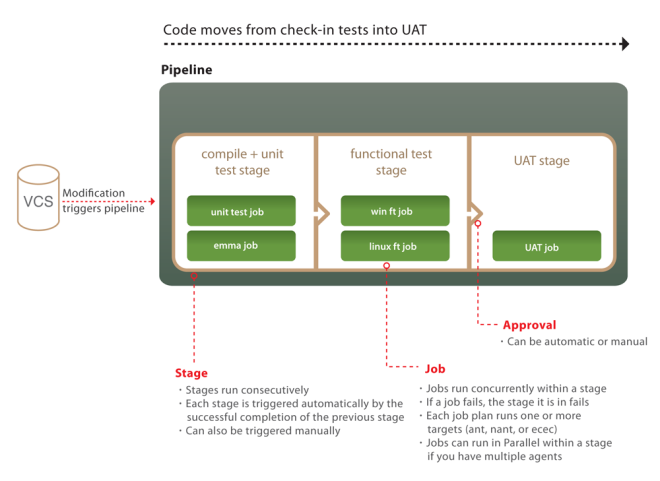

## GoCD Abstractions

(This is just to understand the internals of GoCD; nothing to do with our stages)

****

Although it really is a simplification, it tries to convey visually 2 very important and often misunderstood/ignored characteristics of GoCD:

1. its 4 built-in powerful abstractions and their relationship: *Tasks* inside *Jobs* inside *Stages* inside *Pipelines*

2. the fact that some are executed in parallel (depending on agents availability) while others sequentially:

  * Multiple Pipelines run in parallel
  * Multiple Stages within a Pipeline run sequentially
  * Multiple Jobs within a Stage run in parallel
  * Multiple Tasks within a Job run sequentially

## Pipeline Stages

### 1 - Build Stage

by default it should be snapshot e.g. 1.1.0-SNAPSHOT;
identify & set the build number? so, e.g. it will become 1.1.0-21
ensure that build numbers are same for docker image, git branch, git tag, etc.

* Set new version
* Build (including test)
* Build docker image & push to docker registry

### 2 - Deploy-to-Test-Env Stage

### 3 - Deploy-to-Stage-Env Stage

### 4 - Publish Stage

* Create release branch in git
* Create tag in git

Approve?

### 5 - Promote-to-Prod-Env Stage

